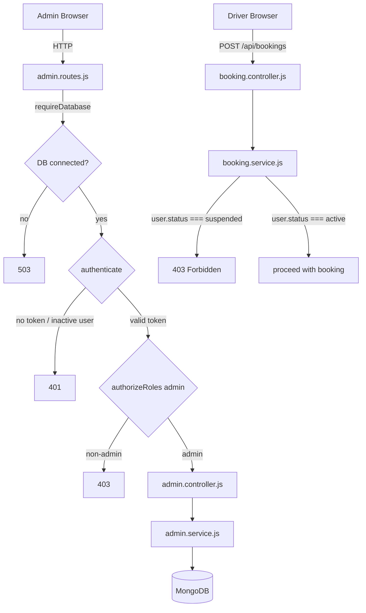

# Design Document — Admin Control System (Phase 9)

## Overview

Phase 9 completes SmartPark's admin layer by filling the gaps between what already exists and what the requirements demand. The existing foundation is solid: protected admin routes, a dashboard with overview/approvals/bookings/users/reports sections, parking moderation (approve/reject/toggle), booking listing, and user listing. What is missing is the ability to act on users (block/unblock), act on bookings (cancel), permanently delete parkings, and enforce the suspended-user constraint in the booking creation path.

The design follows a strict "extend, don't rebuild" principle. Every new capability is added by appending to existing files — no new middleware, no new models, no new router files, no new React pages. The implementation surface is:

- **Backend**: 5 new service functions, 5 new controller handlers, 5 new route registrations, 1 new validator schema, 1 guard added to `booking.service.js`
- **Frontend**: 5 new API functions in `adminApi.js`, 3 UI additions in `AdminDashboardPage.jsx` (block/unblock buttons, delete button, cancel button)

### Key Design Decisions

**Permanent delete vs soft delete for admin parking removal**: The requirements say "permanently delete". The existing `softDeleteParking` in `parking.service.js` only sets `isActive: false`. Admin delete uses `findByIdAndDelete` directly — this is intentional and distinct from the owner soft-delete path. Rationale: admins removing fraudulent listings need hard deletion; owners deactivating their own listings use soft delete.

**Admin booking cancel vs user booking cancel**: The existing `cancelBooking` in `booking.service.js` checks `canAccessBooking` (user must own the booking or be admin). The new admin cancel path in `admin.service.js` is a separate function that skips the ownership check and adds the "already cancelled/completed" guard with HTTP 400 (not idempotent like the user path). Rationale: admin cancel is a moderation action with stricter feedback; user cancel is idempotent by design.

**Self-block guard placement**: The guard lives in the service layer (`blockAdminUser`), not the controller, consistent with how other business rules (e.g., slot availability) are enforced in services.

**Suspended user booking check**: Added as the first check in `createBooking`, before any DB reads. This is a fast-fail that avoids unnecessary DB operations for suspended users.

---

## Architecture

The system follows the existing layered architecture:

```
Client (React)
  └── adminApi.js          ← HTTP calls via apiClient
        │
        ▼
Express Router (/api/admin)
  └── admin.routes.js      ← requireDatabase + authenticate + authorizeRoles('admin')
        │
        ▼
admin.controller.js        ← asyncHandler wrappers, req/res handling
        │
        ▼
admin.service.js           ← business logic, DB access via injected models
        │
        ▼
Mongoose Models            ← User, Parking, Booking
```

The `booking.service.js` suspended-user check sits outside the admin layer — it's a platform-wide guard applied to all booking creation regardless of who initiates it.



---

## Components and Interfaces

### Backend — New Service Functions (`admin.service.js`)

#### `listAdminUsers(deps)`
Returns all users sorted by `createdAt` descending, serialized via `serializeAdminUser`.

```js
export async function listAdminUsers(deps = {}) {
  const UserModel = deps.UserModel ?? User;
  const users = await UserModel.find({}).sort({ createdAt: -1, _id: 1 }).lean();
  return users.map(serializeAdminUser);
}
```

#### `blockAdminUser(id, requestingAdminId, deps)`
Sets `status` to `"suspended"`. Guards against self-block by comparing `id` to `requestingAdminId`. Throws 404 if user not found, 400 if self-block attempted.

```js
export async function blockAdminUser(id, requestingAdminId, deps = {}) {
  const UserModel = deps.UserModel ?? User;
  if (!mongoose.Types.ObjectId.isValid(id)) throw createHttpError(404, 'User not found');
  if (id === requestingAdminId) throw createHttpError(400, 'You cannot block your own account');
  const user = await UserModel.findByIdAndUpdate(id, { status: 'suspended' }, { new: true });
  if (!user) throw createHttpError(404, 'User not found');
  return serializeAdminUser(user);
}
```

#### `unblockAdminUser(id, deps)`
Sets `status` to `"active"`. Throws 404 if user not found.

```js
export async function unblockAdminUser(id, deps = {}) {
  const UserModel = deps.UserModel ?? User;
  if (!mongoose.Types.ObjectId.isValid(id)) throw createHttpError(404, 'User not found');
  const user = await UserModel.findByIdAndUpdate(id, { status: 'active' }, { new: true });
  if (!user) throw createHttpError(404, 'User not found');
  return serializeAdminUser(user);
}
```

#### `deleteAdminParking(id, deps)`
Permanently deletes the parking document. Throws 404 if not found. Uses `findByIdAndDelete` — no soft delete.

```js
export async function deleteAdminParking(id, deps = {}) {
  const ParkingModel = deps.ParkingModel ?? Parking;
  if (!mongoose.Types.ObjectId.isValid(id)) throw createHttpError(404, 'Parking listing not found');
  const parking = await ParkingModel.findByIdAndDelete(id);
  if (!parking) throw createHttpError(404, 'Parking listing not found');
  return { deleted: true, id };
}
```

#### `cancelAdminBooking(id, deps)`
Sets booking `status` to `"cancelled"` and restores `availableSlots` on the parking. Throws 404 if not found, 400 if already cancelled or completed. Runs in a transaction to keep slot counts consistent.

```js
export async function cancelAdminBooking(id, deps = {}) {
  const BookingModel = deps.BookingModel ?? Booking;
  const ParkingModel = deps.ParkingModel ?? Parking;
  const runInTransaction = deps.runInTransaction ?? withTransaction;

  return runInTransaction(async (session) => {
    if (!mongoose.Types.ObjectId.isValid(id)) throw createHttpError(404, 'Booking not found');
    const booking = await BookingModel.findById(id).session(session);
    if (!booking) throw createHttpError(404, 'Booking not found');
    if (booking.status === 'cancelled' || booking.status === 'completed') {
      throw createHttpError(400, `Cannot cancel a booking that is already ${booking.status}`);
    }
    booking.status = 'cancelled';
    await booking.save({ session });
    await ParkingModel.findByIdAndUpdate(
      booking.parking,
      { $inc: { availableSlots: booking.slotCount } },
      { session }
    );
    return serializeAdminBooking(booking);
  });
}
```

### Backend — New Controller Handlers (`admin.controller.js`)

Five new handlers following the existing `asyncHandler` pattern:

| Handler | Method | Path | Service call |
|---|---|---|---|
| `getUsers` | GET | `/users` | `listAdminUsers()` |
| `blockUser` | PATCH | `/users/:id/block` | `blockAdminUser(id, req.user._id.toString())` |
| `unblockUser` | PATCH | `/users/:id/unblock` | `unblockAdminUser(id)` |
| `deleteParking` | DELETE | `/parkings/:id` | `deleteAdminParking(id)` |
| `cancelBooking` | PATCH | `/bookings/:id/cancel` | `cancelAdminBooking(id)` |

All return `{ success: true, data: { ... } }` consistent with existing handlers.

### Backend — New Routes (`admin.routes.js`)

Five new route registrations appended to the existing router (middleware already applied via `adminRoutes.use(...)`):

```js
adminRoutes.get('/users', getUsers);
adminRoutes.patch('/users/:id/block', blockUser);
adminRoutes.patch('/users/:id/unblock', unblockUser);
adminRoutes.delete('/parkings/:id', deleteParking);
adminRoutes.patch('/bookings/:id/cancel', cancelBooking);
```

### Backend — Validator Addition (`admin.validator.js`)

New schema for user ID path parameter validation (optional, used for consistent error messages):

```js
export const adminUserIdParamSchema = z.object({
  id: z.string().regex(/^[a-f\d]{24}$/i, 'Invalid user ID format')
});
```

### Backend — Booking Guard (`booking.service.js`)

One line added at the top of `createBooking`, before any DB operations:

```js
if (user.status === 'suspended') {
  throw createHttpError(403, 'Your account has been suspended. You cannot create new bookings.');
}
```

### Frontend — New API Functions (`adminApi.js`)

Five new functions following the existing `apiClient` pattern:

```js
export async function fetchAdminUsers() {
  const response = await apiClient.get('/admin/users');
  return response.data.data.users;
}

export async function blockAdminUser(id) {
  const response = await apiClient.patch(`/admin/users/${id}/block`);
  return response.data.data.user;
}

export async function unblockAdminUser(id) {
  const response = await apiClient.patch(`/admin/users/${id}/unblock`);
  return response.data.data.user;
}

export async function deleteAdminParking(id) {
  const response = await apiClient.delete(`/admin/parkings/${id}`);
  return response.data.data;
}

export async function cancelAdminBooking(id) {
  const response = await apiClient.patch(`/admin/bookings/${id}/cancel`);
  return response.data.data.booking;
}
```

### Frontend — AdminDashboardPage Changes

**AdminUsers section**: Add `currentAdminId` prop (from `useAuth`). For each user row, render a "Block" button if `user.status === 'active'` and `user.id !== currentAdminId`, or an "Unblock" button if `user.status === 'suspended'`. On click, call the appropriate API function, then replace the user in the local `dashboard.users` array with the returned updated user. On error, call `setError(getApiErrorMessage(...))`.

**ModerationSection / AdminApprovals section**: Add a "Delete" button to each parking card. On click, call `deleteAdminParking(parking.id)`, then remove the parking from the local `dashboard.parkings` state (filter it out of all three arrays). On error, call `setError(getApiErrorMessage(...))`.

**AdminBookings section**: For each booking row where `booking.status === 'pending' || booking.status === 'confirmed'`, render a "Cancel" button. On click, call `cancelAdminBooking(booking.id)`, then replace the booking in the local `bookings` array with the returned updated booking. On error, call `setError(getApiErrorMessage(...))`.

State update helpers follow the existing `replaceParking` pattern — pure functions that return new state objects without mutating existing state.

---

## Data Models

No model changes are required. All fields used by Phase 9 already exist:

| Model | Field | Type | Used by |
|---|---|---|---|
| `User` | `status` | `enum['active','suspended']` | block/unblock, booking guard, auth middleware |
| `Parking` | `verificationStatus` | `enum['pending','approved','rejected']` | approve/reject, search filter |
| `Parking` | `isActive` | `Boolean` | toggle, search filter |
| `Booking` | `status` | `enum['pending','confirmed','cancelled','completed']` | admin cancel guard |
| `Booking` | `slotCount` | `Number` | slot restoration on cancel |

### Serialized Shapes

**`serializeAdminUser` output** (already implemented, no changes needed):
```json
{
  "id": "string",
  "name": "string",
  "email": "string",
  "role": "driver|owner|admin",
  "phone": "string",
  "status": "active|suspended",
  "createdAt": "Date"
}
```

**`serializeAdminBooking` output** (already implemented, no changes needed):
```json
{
  "id": "string",
  "user": "string",
  "userName": "string",
  "userEmail": "string",
  "parking": "string",
  "parkingTitle": "string",
  "vehicleType": "string",
  "bookingDate": "string",
  "startTime": "string",
  "endTime": "string",
  "slotCount": "number",
  "totalAmount": "number",
  "status": "pending|confirmed|cancelled|completed",
  "createdAt": "Date",
  "updatedAt": "Date"
}
```

**`deleteAdminParking` response data**:
```json
{ "deleted": true, "id": "string" }
```

---

## Correctness Properties

*A property is a characteristic or behavior that should hold true across all valid executions of a system — essentially, a formal statement about what the system should do. Properties serve as the bridge between human-readable specifications and machine-verifiable correctness guarantees.*

### Property Reflection

Before listing properties, redundancies are eliminated:

- Requirements 2.2, 2.3, 2.4, 2.5, 2.6 all describe counting invariants on the same `summary` object. These are combined into one comprehensive summary-counts property.
- Requirements 2.7 and 2.8 describe grouping invariants on the same dashboard response. Combined into one dashboard-grouping property.
- Requirements 10.1 and 10.2 both describe the search filter invariant. Combined into one search-filter property.
- Requirements 14.2 and 14.3 describe complementary conditional rendering (Block vs Unblock). Combined into one button-visibility property.
- Requirements 15.2, 15.3, 15.4 describe button visibility per verificationStatus. Combined into one parking-button-visibility property.
- Requirements 3.3 and 3.4 both describe serializer output. Combined into one serializer-fields property.
- Requirements 4.1 and 4.2 describe a block/unblock round-trip. Combined into one round-trip property.
- Requirements 11.3 and 11.4 both describe booking serializer output. Combined into one booking-serializer property.

---

### Property 1: Dashboard summary counts match actual document counts

*For any* state of the database with any number of Parking, Booking, and User documents, the `summary` object returned by `getAdminDashboard` SHALL have `pendingApprovals` equal to the count of parkings with `verificationStatus === "pending"`, `approvedListings` equal to the count with `verificationStatus === "approved"`, `totalBookings` equal to the total booking count, `totalUsers` equal to the total user count, and `inactiveListings` equal to the count of parkings with `isActive === false`.

**Validates: Requirements 2.2, 2.3, 2.4, 2.5, 2.6**

---

### Property 2: Dashboard grouping is exhaustive and exclusive

*For any* collection of parking documents, the `parkings` object returned by `getAdminDashboard` SHALL partition every parking into exactly one of `pending`, `approved`, or `rejected` arrays, with each parking appearing in the array that matches its `verificationStatus`, and no parking appearing in more than one array.

**Validates: Requirements 2.8**

---

### Property 3: Dashboard userMetrics counts match actual user distribution

*For any* collection of User documents with any combination of `role` and `status` values, the `userMetrics` object returned by `getAdminDashboard` SHALL have `drivers` equal to the count of users with `role === "driver"`, `owners` equal to the count with `role === "owner"`, `admins` equal to the count with `role === "admin"`, and `suspended` equal to the count with `status === "suspended"`.

**Validates: Requirements 2.7**

---

### Property 4: Admin user serializer includes required fields and excludes credentials

*For any* User document (including one with a `passwordHash` field), `serializeAdminUser` SHALL return an object containing `id`, `name`, `email`, `role`, `phone`, `status`, and `createdAt`, and SHALL NOT contain `passwordHash` or any other credential field.

**Validates: Requirements 3.3, 3.4**

---

### Property 5: User list is sorted by createdAt descending

*For any* collection of User documents with distinct `createdAt` timestamps, `listAdminUsers` SHALL return an array where each element has a `createdAt` value greater than or equal to the `createdAt` of the next element (descending order).

**Validates: Requirements 3.2**

---

### Property 6: Block then unblock is a round-trip restoring active status

*For any* user (regardless of initial status), calling `blockAdminUser` followed by `unblockAdminUser` SHALL result in the user having `status === "active"`, and calling `blockAdminUser` alone SHALL result in `status === "suspended"`.

**Validates: Requirements 4.1, 4.2**

---

### Property 7: Suspended users are rejected by authenticate middleware

*For any* user whose `status` is set to `"suspended"`, any subsequent request using that user's valid JWT SHALL be rejected by `authenticate` middleware with HTTP 401, because the middleware re-fetches the user from the database and checks `status !== 'active'`.

**Validates: Requirements 5.2**

---

### Property 8: Suspended users cannot create bookings

*For any* user with `status === "suspended"` and any otherwise-valid booking input, `createBooking` SHALL throw an HTTP 403 error before performing any database write operations.

**Validates: Requirements 6.1, 6.2**

---

### Property 9: Search results contain only approved and active listings

*For any* search query parameters passed to the Search_Service, the resulting MongoDB filter SHALL always include `verificationStatus: "approved"` and `isActive: true`, and no document with `verificationStatus !== "approved"` SHALL appear in the results.

**Validates: Requirements 10.1, 10.2**

---

### Property 10: Admin booking serializer includes all required fields

*For any* Booking document with populated `user` and `parking` references, `serializeAdminBooking` SHALL return an object containing `id`, `user`, `userName`, `userEmail`, `parking`, `parkingTitle`, `vehicleType`, `bookingDate`, `startTime`, `endTime`, `slotCount`, `totalAmount`, `status`, `createdAt`, and `updatedAt`.

**Validates: Requirements 11.3, 11.4**

---

### Property 11: Admin booking filter returns only matching bookings

*For any* combination of `status`, `parking`, and `user` filter values, `listAdminBookings` SHALL return only bookings where every provided filter field matches the booking's corresponding field.

**Validates: Requirements 11.2**

---

### Property 12: Admin cancel rejects terminal-state bookings

*For any* booking with `status === "cancelled"` or `status === "completed"`, `cancelAdminBooking` SHALL throw an HTTP 400 error and SHALL NOT modify the booking's status or the parking's `availableSlots`.

**Validates: Requirements 12.3**

---

### Property 13: Admin cancel sets status to cancelled for active bookings

*For any* booking with `status === "pending"` or `status === "confirmed"`, `cancelAdminBooking` SHALL set the booking's `status` to `"cancelled"` and SHALL increment the associated parking's `availableSlots` by the booking's `slotCount`.

**Validates: Requirements 12.1**

---

### Property 14: Block/unblock button visibility is mutually exclusive and self-exclusive

*For any* list of users rendered in the AdminUsers section, a user row SHALL display a "Block" button if and only if `user.status === "active"` AND `user.id !== currentAdminId`, and SHALL display an "Unblock" button if and only if `user.status === "suspended"`. The currently authenticated admin's own row SHALL display neither button.

**Validates: Requirements 14.2, 14.3, 14.7**

---

### Property 15: Parking moderation buttons match verificationStatus

*For any* parking card rendered in the AdminApprovals section, the set of action buttons SHALL match the parking's `verificationStatus`: pending parkings show Approve + Reject + Delete; approved parkings show Reject + Toggle + Delete; rejected parkings show Approve + Toggle + Delete.

**Validates: Requirements 15.2, 15.3, 15.4**

---

### Property 16: Cancel button appears only for cancellable bookings

*For any* booking row rendered in the AdminBookings section, a "Cancel" button SHALL be present if and only if `booking.status === "pending"` OR `booking.status === "confirmed"`.

**Validates: Requirements 16.2**

---

### Property 17: Admin API error propagation

*For any* Admin_API function call that results in an HTTP error response, the function SHALL reject with the original error object (not swallow it), so that callers can extract the message using `getApiErrorMessage`.

**Validates: Requirements 13.4**

---

## Error Handling

### Backend Error Responses

All errors follow the existing `createHttpError` pattern and are caught by the global error handler in `app.js`.

| Scenario | HTTP Status | Message |
|---|---|---|
| No JWT / invalid JWT | 401 | `"Authentication token is required"` / `"Invalid or expired authentication token"` |
| Suspended user making request | 401 | `"User account is not active"` |
| Non-admin role | 403 | `"You do not have permission to access this resource"` |
| Suspended user creating booking | 403 | `"Your account has been suspended. You cannot create new bookings."` |
| Admin self-block attempt | 400 | `"You cannot block your own account"` |
| Cancel already-cancelled booking | 400 | `"Cannot cancel a booking that is already cancelled"` |
| Cancel completed booking | 400 | `"Cannot cancel a booking that is already completed"` |
| User/Parking/Booking not found | 404 | `"User not found"` / `"Parking listing not found"` / `"Booking not found"` |
| Invalid ObjectId format | 404 | Same as not found (fail-safe) |
| Reject reason too short/long | 400 | Zod validation message |

### Frontend Error Handling

All API calls in `AdminDashboardPage.jsx` are wrapped in try/catch. On error, `getApiErrorMessage(error, fallbackMessage)` extracts the server message and sets it via `setError(...)`. The error banner is already rendered at the top of the page. No new error UI components are needed.

For user block/unblock and booking cancel, errors are displayed in the same top-level error banner. This is consistent with how parking moderation errors are currently handled via `applyParkingUpdate`.

---

## Testing Strategy

### Unit Tests (Example-Based)

Focus on specific behaviors and edge cases that complement the property tests:

**`admin.service.js`**:
- `blockAdminUser` with self-block returns 400
- `blockAdminUser` with non-existent ID returns 404
- `unblockAdminUser` with non-existent ID returns 404
- `deleteAdminParking` with non-existent ID returns 404
- `cancelAdminBooking` with non-existent ID returns 404
- `cancelAdminBooking` with `status === "completed"` returns 400

**`booking.service.js`**:
- `createBooking` with suspended user returns 403 before any DB write

**`admin.validator.js`**:
- `adminRejectParkingSchema` rejects reason with length < 3
- `adminRejectParkingSchema` rejects reason with length > 500

**`adminApi.js`** (frontend):
- Each function calls the correct HTTP method and URL
- Each function returns the correct data shape from the response

**`AdminDashboardPage.jsx`** (frontend):
- Block button absent for current admin's own row
- Unblock button shown for suspended user
- Cancel button absent for completed/cancelled bookings

### Property-Based Tests

Using **fast-check** (already a common choice for JS/TS property testing) with minimum 100 iterations per property.

**Tag format**: `// Feature: admin-control-system, Property N: <property_text>`

**Properties to implement as PBT**:

| Property | Test target | Generator |
|---|---|---|
| P1: Summary counts | `getAdminDashboard` (mocked models) | Random arrays of parkings/bookings/users with random statuses |
| P2: Parking grouping | `groupParkingsByStatus` (pure function) | Random parking arrays with random verificationStatus |
| P3: UserMetrics counts | `getAdminDashboard` (mocked models) | Random user arrays with random role/status combinations |
| P4: Serializer fields + no credentials | `serializeAdminUser` | Random user objects including passwordHash |
| P5: User list sort order | `listAdminUsers` (mocked model) | Random user arrays with random createdAt values |
| P6: Block/unblock round-trip | `blockAdminUser` + `unblockAdminUser` (mocked model) | Random user IDs and initial statuses |
| P8: Suspended user booking rejection | `createBooking` (mocked deps) | Random booking inputs with suspended user |
| P9: Search filter invariant | `buildPublicParkingFilter` (pure function) | Random query parameter combinations |
| P10: Booking serializer fields | `serializeAdminBooking` | Random booking objects with populated user/parking |
| P11: Booking filter correctness | `listAdminBookings` (mocked model) | Random filter combinations and booking arrays |
| P12: Cancel terminal-state guard | `cancelAdminBooking` (mocked deps) | Bookings with status "cancelled" or "completed" |
| P13: Cancel active booking | `cancelAdminBooking` (mocked deps) | Bookings with status "pending" or "confirmed" |
| P14: Block/unblock button visibility | `AdminUsers` component (React Testing Library) | Random user arrays with random statuses and a random currentAdminId |
| P15: Parking button visibility | `ModerationSection` component | Random parking arrays with random verificationStatus |
| P16: Cancel button visibility | `AdminBookings` component | Random booking arrays with random statuses |
| P17: API error propagation | `adminApi.js` functions (mocked axios) | Random HTTP error responses |

### Integration Tests

- `GET /api/admin/users` returns 401 without token, 403 with driver token, 200 with admin token
- `PATCH /api/admin/users/:id/block` blocks a real user in test DB
- `PATCH /api/admin/users/:id/unblock` unblocks a real user in test DB
- `DELETE /api/admin/parkings/:id` removes parking from test DB
- `PATCH /api/admin/bookings/:id/cancel` cancels booking and restores slots in test DB
- Suspended user login returns 403 with correct message
- Suspended user booking creation returns 403
