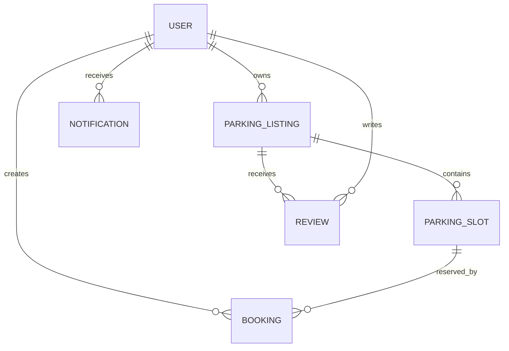

# Data Model

## Entity Overview



## User

Represents every platform account.

```js
{
  _id: ObjectId,
  name: String,
  email: String,
  passwordHash: String,
  role: "driver" | "owner" | "admin",
  phone: String,
  status: "active" | "suspended",
  createdAt: Date,
  updatedAt: Date
}
```

Important indexes:

- Unique index on `email`.
- Index on `role`.

## ParkingListing

Represents a parking location owned by a user.

```js
{
  _id: ObjectId,
  owner: ObjectId,
  title: String,
  description: String,
  address: {
    line1: String,
    city: String,
    state: String,
    postalCode: String,
    country: String
  },
  location: {
    type: "Point",
    coordinates: [Number, Number]
  },
  pricePerHour: Number,
  amenities: [String],
  images: [String],
  rules: [String],
  totalSlots: Number,
  status: "draft" | "pending_review" | "active" | "paused" | "rejected",
  createdAt: Date,
  updatedAt: Date
}
```

Important indexes:

- `2dsphere` index on `location`.
- Index on `owner`.
- Index on `status`.
- Compound index on `status` and `pricePerHour`.

## ParkingSlot

Represents a specific rentable slot. MVP can generate slots from listing capacity.

```js
{
  _id: ObjectId,
  listing: ObjectId,
  label: String,
  type: "car" | "bike" | "ev" | "accessible",
  status: "active" | "maintenance" | "inactive",
  createdAt: Date,
  updatedAt: Date
}
```

Important indexes:

- Index on `listing`.
- Compound index on `listing` and `status`.

## Booking

Represents a reservation for a parking slot.

```js
{
  _id: ObjectId,
  user: ObjectId,
  listing: ObjectId,
  slot: ObjectId,
  startsAt: Date,
  endsAt: Date,
  status: "pending" | "confirmed" | "cancelled" | "completed",
  totalPrice: Number,
  notes: String,
  createdAt: Date,
  updatedAt: Date
}
```

Important indexes:

- Index on `user`.
- Index on `listing`.
- Compound index on `slot`, `startsAt`, `endsAt`, and `status`.

Conflict rule:

```text
An existing reservation conflicts when:
existing.startsAt < requested.endsAt
AND existing.endsAt > requested.startsAt
AND existing.slot == requested.slot
AND existing.status in ["pending", "confirmed"]
```

## Review

Represents post-booking feedback.

```js
{
  _id: ObjectId,
  user: ObjectId,
  listing: ObjectId,
  booking: ObjectId,
  rating: Number,
  comment: String,
  createdAt: Date,
  updatedAt: Date
}
```

Important indexes:

- Unique index on `booking`.
- Index on `listing`.

## Notification

Stores in-app notifications and future email/SMS event state.

```js
{
  _id: ObjectId,
  user: ObjectId,
  type: "booking_created" | "booking_cancelled" | "listing_approved" | "system",
  title: String,
  message: String,
  readAt: Date,
  metadata: Object,
  createdAt: Date
}
```

Important indexes:

- Compound index on `user`, `readAt`, and `createdAt`.
