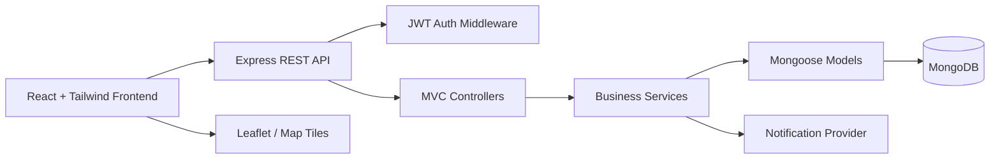

# Phase 1 Architecture And Planning

## Mission

Build a production-minded MVP for a smart parking slot rental and availability platform. The first version should let users find parking, owners publish spaces, and authenticated users book available slots without double-booking conflicts.

## Product Requirements

### Primary Goals

- Help drivers search nearby parking spaces by location, date, time, price, and amenities.
- Let parking owners create and manage parking listings and availability.
- Let users book available slots securely.
- Prevent overlapping confirmed bookings for the same parking slot.
- Give owners a simple dashboard to track listings, bookings, and revenue.
- Give admins moderation tools for users, listings, and disputes.

### Non-Goals For MVP

- Real payment capture.
- Complex dynamic pricing.
- AI recommendations.
- Native mobile app.
- Hardware sensor integration.
- Real-time IoT availability.

These can be added in Phase 15 or later once the core product is stable.

## Actors

### Driver

The driver searches for parking, views slot details, creates bookings, manages booking history, and receives notifications.

### Parking Owner

The owner creates parking listings, defines slot counts and pricing, manages availability, views booking requests, and tracks earnings.

### Admin

The admin reviews platform activity, moderates users and listings, resolves disputes, and can deactivate unsafe or fraudulent records.

### Guest

The guest can browse public listings and view limited slot information, but must sign up or log in before booking.

## Core User Flows

### Driver Search And Booking

1. User opens search page.
2. User enters location and desired date/time.
3. System returns matching active listings.
4. User opens listing detail page.
5. System shows price, amenities, map location, rules, and available slots.
6. User logs in if needed.
7. User submits booking request.
8. Backend validates no overlapping confirmed booking exists.
9. System creates booking and updates availability view.

### Owner Listing Creation

1. Owner logs in.
2. Owner opens dashboard.
3. Owner creates listing with address, coordinates, slot count, pricing, amenities, images, and rules.
4. System validates required fields and stores listing as pending review or active.
5. Owner can edit, pause, or delete listing later.

### Admin Moderation

1. Admin logs in.
2. Admin views users, listings, bookings, and reports.
3. Admin approves, suspends, or rejects records.
4. System writes audit-friendly status changes.

## Feature Modules

### Backend Modules

- Auth: register, login, JWT issuing, password hashing, role authorization.
- Users: profile, role, account status.
- Listings: owner-created parking spaces with geo coordinates and business rules.
- Slots: rentable units within a listing, either explicit slots or slot count inventory.
- Search: location, price, amenity, and time filters.
- Bookings: reservation lifecycle and conflict prevention.
- Reviews: post-booking ratings and comments.
- Notifications: email/in-app event records.
- Admin: moderation and platform overview.

### Frontend Modules

- Auth pages and protected route handling.
- Public listing search page.
- Listing detail view.
- Booking form and confirmation view.
- Driver dashboard.
- Owner dashboard.
- Admin dashboard.
- Shared UI components.
- API client layer.
- Map components.

## Architecture



## Backend Structure

The backend will use MVC with a small service layer for business rules that should not live directly in controllers.

```text
server/
  src/
    config/
    controllers/
    middleware/
    models/
    routes/
    services/
    utils/
    validators/
    app.js
    server.js
```

## Frontend Structure

The frontend will use feature folders and shared components. This keeps screens, API calls, and feature-specific components close together.

```text
client/
  src/
    app/
    assets/
    components/
    features/
      auth/
      listings/
      bookings/
      owner/
      admin/
      maps/
    hooks/
    lib/
    pages/
    routes/
    styles/
```

## Repository Structure

```text
smartpark/
  client/
  server/
  docs/
  README.md
  .gitignore
  package.json
```

## MVP Scope

### Included

- Email/password auth with JWT.
- User roles: driver, owner, admin.
- Owner parking listing CRUD.
- Search listings by location text, price, amenities, and availability window.
- Listing detail page.
- Booking creation with overlap conflict prevention.
- Driver booking history.
- Owner dashboard for listings and bookings.
- Basic admin listing/user moderation.
- Leaflet map display.
- Basic notification records.
- Deployment-ready environment configuration.

### Deferred

- Payment gateway.
- Real-time chat.
- AI recommendations.
- Advanced analytics.
- Native mobile apps.
- IoT sensor availability.

## Key Technical Decisions

- Use MongoDB geospatial indexes for listing location search.
- Use JWT access tokens stored client-side with careful API handling. Refresh tokens can be added after the MVP if needed.
- Use `bcrypt` for password hashing.
- Use role middleware for driver, owner, and admin access control.
- Use a booking conflict query guarded by database indexes and transaction-aware service logic.
- Use Leaflet for MVP because it is free and fast to integrate. Google Maps can be added later if product needs justify it.

## Risks And Edge Cases

- Double-booking when two users book the same slot at nearly the same time.
- Timezone errors when users choose booking times.
- Incomplete or inaccurate owner addresses.
- Fake listings or spam users.
- Search results that look available but become unavailable before booking.
- Owners changing or deleting listings with future bookings.
- Admin actions needing traceability.
- Map provider API limits or tile restrictions.

## Beginner Mistakes To Avoid

- Putting booking conflict logic only in frontend checks.
- Storing passwords as plain text or using weak hashing.
- Mixing controller, database, and business logic in one large file.
- Trusting client-provided roles or owner IDs.
- Forgetting indexes for location and booking queries.
- Using local time strings instead of UTC dates in the backend.
- Building dashboards before the core booking rules are reliable.

## Phase 1 Done Criteria

- Product scope is clear.
- Actors and flows are documented.
- Backend and frontend module boundaries are defined.
- Database entities are identified.
- Initial REST API contracts are documented.
- MVP and deferred features are separated.
- Phase 2 can scaffold the repository without guessing the architecture.

## Phase 1 Testing Checklist

Because Phase 1 is a planning phase, verification means checking the plan for completeness and implementation readiness.

- PRD has clear goals and non-goals.
- Actors cover guest, driver, owner, and admin behavior.
- User flows cover the main MVP path from search to booking.
- Database entities support auth, listings, slots, bookings, reviews, and notifications.
- Booking conflict prevention is documented before code is written.
- API contracts include access rules and validation expectations.
- Folder structure supports MVC backend and modular React frontend.
- MVP scope is small enough to build incrementally.
- Risks and beginner mistakes are visible before implementation starts.
